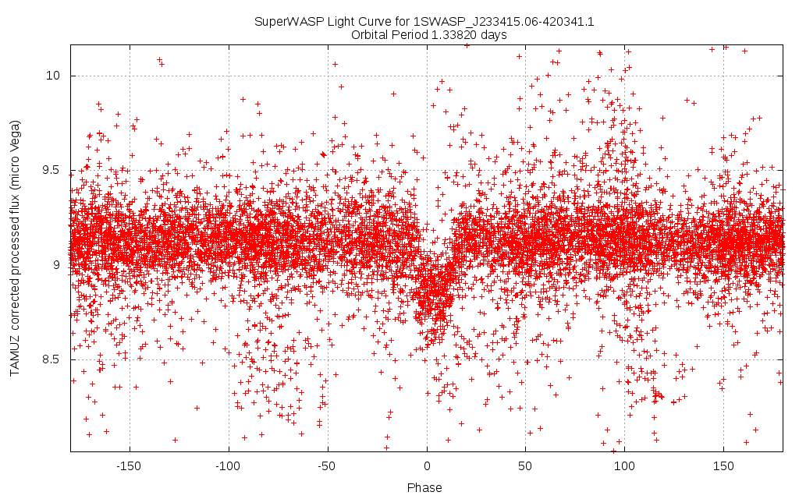

WASPscan
========

This utility takes log files produced by SuperWASP and searches for exoplanet transits within them, producing plots if any are found. A range of possible orbital periods can be given, or if the period is already known then that can be specified.

For more information see:

    https://en.wikipedia.org/wiki/SuperWASP
    http://wasp-planets.net

Installation
------------
Installation is pretty conventional:

    sudo apt-get install build-essential gnuplot python3-astropy
    make
    sudo make install

You will also need to obtain the SuperWASP log files. These can be ontained from:

    http://exoplanetarchive.ipac.caltech.edu/docs/SuperWASPBulkDownload.html

There are a couple of scripts which contain many *wget* commands which download individual observation series for particular stars. For the currently known exoplanets:

    mkdir data
    cd data
    wget http://exoplanetarchive.ipac.caltech.edu/data/ETSS/SuperWASP/metadata/SuperWASP_confirmed_wget.bat

And for all the available data:

    wget http://exoplanetarchive.ipac.caltech.edu/bulk_data_download/SuperWASP_wget.tar.gz
    tar -xzvf SuperWASP_wget.tar.gz

Once you've downloaded those you can open *SuperWASP_confirmed_wget.bat* in your favourite editor and manually run individual wgets, or make it executable and download all the data sets. Please be warned that downloading all of the data series could take a very long time, so you may want to be selective.

File Formats
------------
The two file formats used are *fits* and *tbl*. waspscan only uses the tbl format, so if you have fits files those can be converted with:

    fits2tbl [fits filename] > [table filename]

Or for non-WASP fits files:

    fits2tbl [fits filename] [table index] > [table filename]

Where the table index is a number of the table inside of the fits file.

Usage
-----
Within data/SuperWASP_tile000042_wget.bat:

    wget -O '1SWASP_J001905.33-441133.1_lc.tbl' 'http://exoplanetarchive.ipac.caltech.edu:80/data/ETSS//SuperWASP/TBL/DR1/tile000042/1SWASP_J001905.33-441133.1_lc.tbl' -a search_336789464.log

To search for a transit within a range of orbital periods:

    waspscan -f 1SWASP_J001905.33-441133.1_lc.tbl --min 2.0 --max 2.1

The above will search a particular log file for orbits in the range 2.0 to 2.1 days. If a transit is found then it will be plotted as *png* files saved to the current directory.

    > 10554 values loaded
    > orbital_period_days 2.075600

We found one! We can view it with:

    shotwell 1SWASP_J001905.33-441133.1_lc_distr.png

But it doesn't look quite right. We can manually tweak around with the orbital period to get the light curve as focussed as possible:

    waspscan -f 1SWASP_J001905.33-441133.1_lc.tbl --period 2.07592
    shotwell 1SWASP_J001905.33-441133.1_lc_distr.png

And also increase the vertical scale a little:

    waspscan -f 1SWASP_J001905.33-441133.1_lc.tbl --period 2.07592 --vscale 1.4
    shotwell 1SWASP_J001905.33-441133.1_lc_distr.png

If you want to scan multiple *tbl* files or *fits* files within a directory there's also a helper script for that purpose:

    waspscandir [minimum period] [maximum period]

Other parameters can also be specified. See the --help option for details.

Log files will be scanned one by one and if transits are found then plot images will be generated for them within the same directory for subsequent manual review.

Scaling up the search
---------------------
It is also possible to install a daemon which will search through light curves and report its results.

    sudo startwaspd --archive [bulk data download url]
                    --start [percent] --end [percent]
                    --min [period days] --max [period days]
                    --minsamples [number]
                    --email [email address]
                    --store [path]
                    --minfilesize [bytes]

The start and end percent values indicate where within the total data set the daemon will begin searching and where it will end. Hence you can distribute the search across multiple machines, each searching only a portion of the data. The --email parameter is optional and will only work if the machine has an email server installed. If an email address is set then when a candidate transit is detected a corresponding email will be sent. The --minsamples parameter can be used to set a lower bound on the number of samples (observations) in the data set. If this value is too low then there won't be enough data to have much confidence if a possible transit is found.

The *--store* option can be used to store all of the downloaded files to some particular directory. By default only data for candidate transits are stored and all other data is disguared. Storing the data may be useful if you have plenty of storage space and if you may want to do a second detection run over the same data. If you use this option then *--minfilesize* can also be used to set a minimum file size to store, otherwise many files containing only one or two samples will be stored, which are unlikely to be useful for any subsequent analysis.

You can check whether the daemon is running with:

    systemctl status waspd

or otherwise just:

    ps aux | grep waspd

Any candidate transits will be saved into the directory */home/wasp/candidates*

Transits found so far
---------------------

J191554.35+380338.2 and J001905.33-441133.1 are possible exotrojan systems.

J001128.53-443020.8 has a possible [opposition surge](https://en.wikipedia.org/wiki/Opposition_surge)

| Series              | Period (days) | RA         | Dec        | Date       |
|---------------------|---------------|------------|------------|------------|
| J001905.33-441133.1 |  2.07592      |   4.772222 | -44.192553 | 2016-03-06 |
| J001128.53-443020.8 |  0.95055      |   2.868903 | -44.505783 | 2016-03-06 |
| J000948.40-442017.0 |  1.05621      |   2.451678 | -44.338056 | 2016-03-01 |
| J191552.31+380252.2 |  1.69107      | 288.967958 |  38.047858 | 2016-01-15 |
| J191554.35+380338.2 |  2.28720      | 288.976461 |  38.060628 | 2016-01-15 |
| J191548.18+380236.2 |  1.69142      | 288.950786 |  38.043403 | 2016-01-03 |
| J191549.90+380240.1 |  1.69104      | 288.957942 |  38.044497 | 2016-01-03 |
| J191550.32+380251.1 |  1.68959      | 288.959689 |  38.047547 | 2016-01-03 |
| J191443.55+391944.9 |  1.37791      | 288.681475 |  39.329156 | 2016-01-01 |
| J191418.55+382730.6 |  1.31440      | 288.577297 |  38.458506 | 2015-12-31 |
| J191412.95+382646.8 |  1.31615      | 288.553969 |  38.446347 | 2015-12-31 |
| J192648.00+355855.8 |  1.55505      | 291.700039 |  35.982169 | 2015-12-26 |
| J211848.09+533925.8 |  0.82627      | 319.700378 |  53.657186 | 2015-05-16 |
| J211845.72+533944.0 |  0.82627      | 319.690506 |  53.662228 | 2015-05-16 |
| J212231.01+522639.2 |  4.145        | 320.629211 |  52.444239 | 2015-05-16 |
| J212234.52+485650.1 |  0.9347       | 320.643861 |  48.947272 | 2015-05-16 |
| J211849.81+534028.4 |  0.825695     | 319.707581 |  53.674575 | 2015-05-16 |
| J212145.92+510923.6 |  1.25202      | 320.441367 |  51.156575 | 2015-05-16 |
| J211300.19+523120.0 |  1.87395      | 318.2508   |  52.52242  | 2015-05-10 |
| J211324.40+533638.4 |  1.32870      | 318.351672 |  53.610672 | 2015-05-10 |
| J211359.94+512655.7 |  0.849755     | 318.49975  |  51.448808 | 2015-05-10 |
| J211401.27+512618.0 |  0.849905     | 318.505308 |  51.438358 | 2015-05-10 |
| J213207.57+423029.3 |  1.05077      | 323.031581 |  42.508156 | 2015-05-10 |
